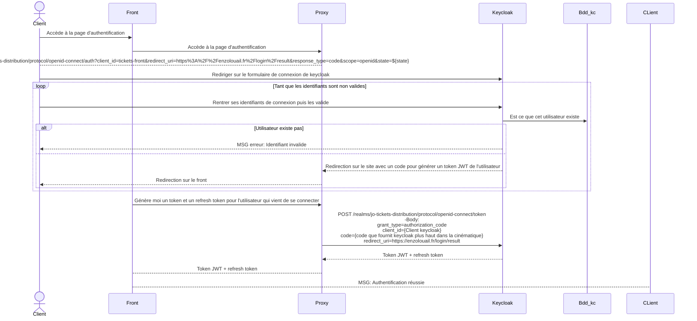
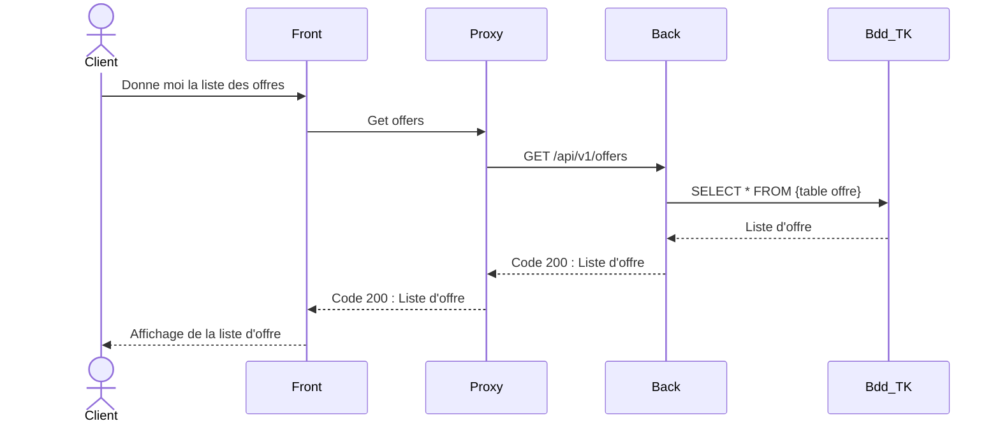
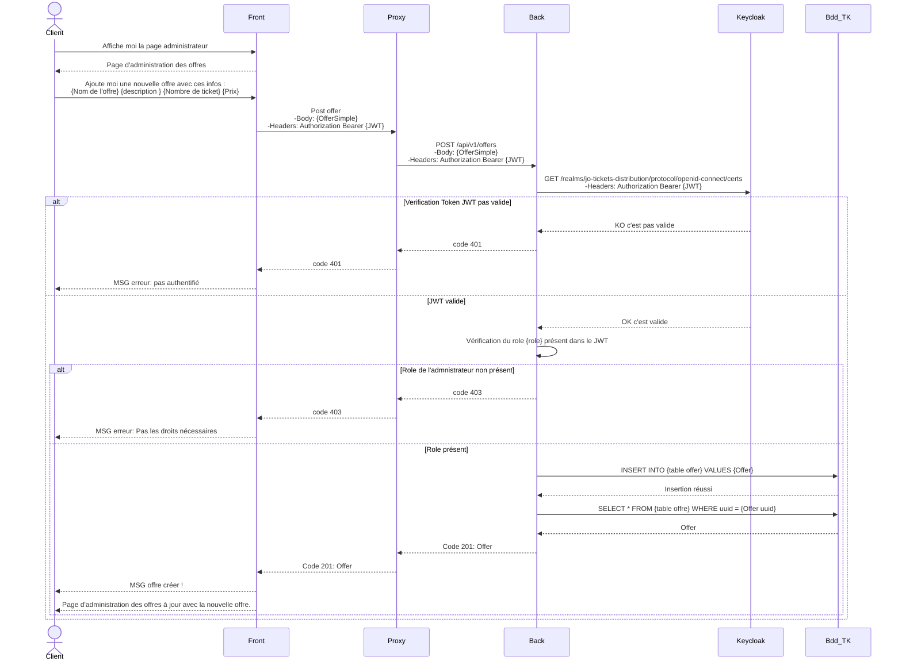
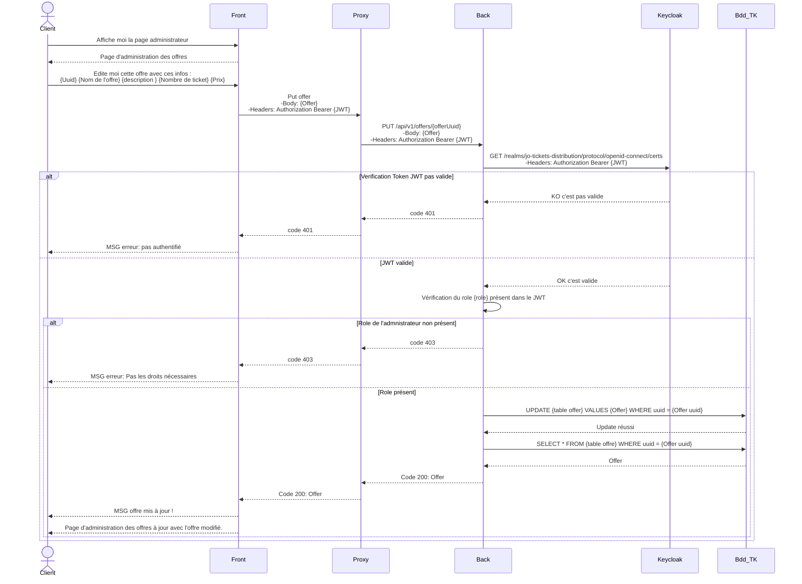
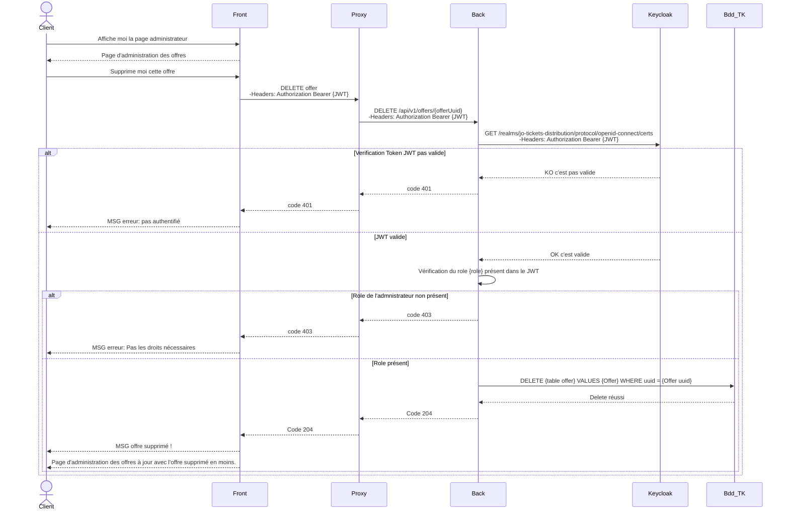
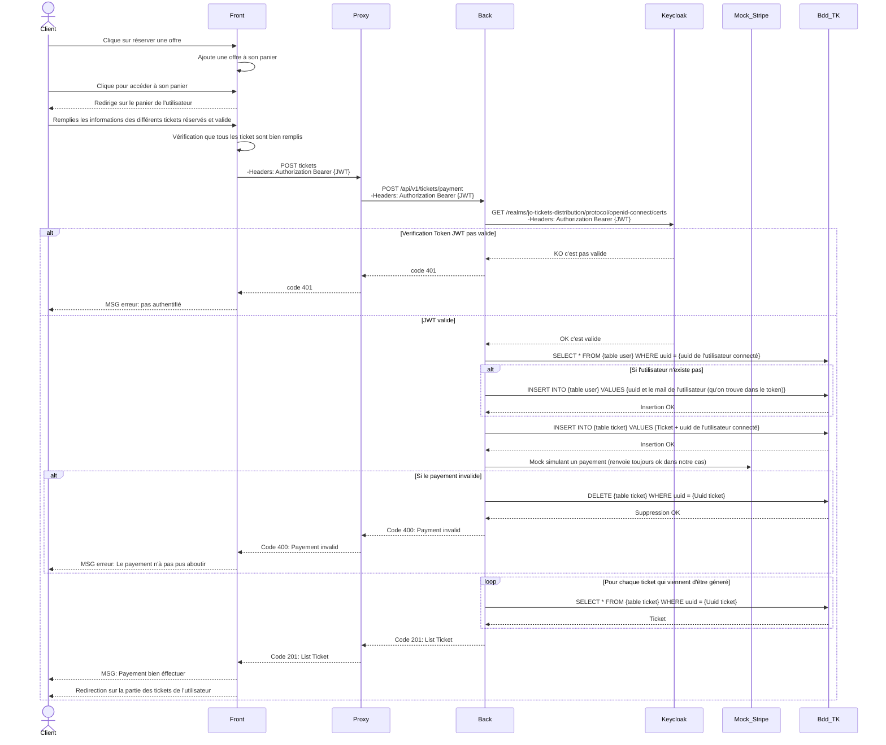
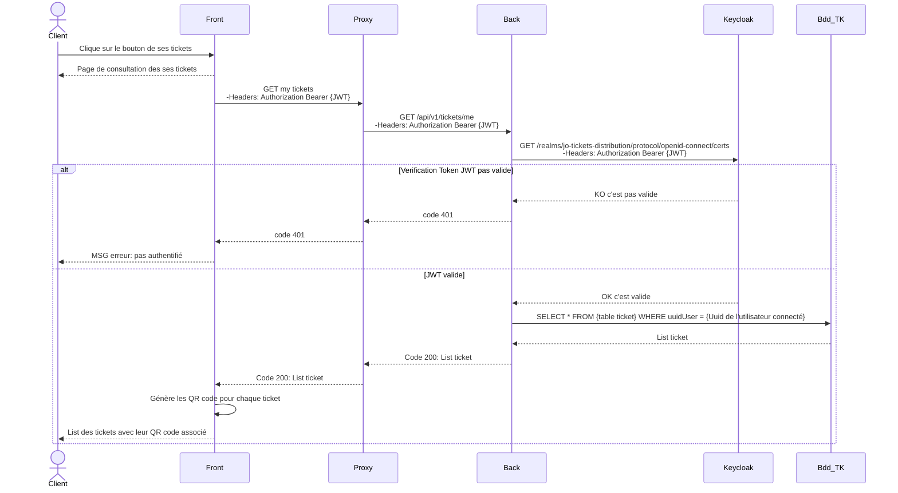

# Tickets API
Tickets API est une application Spring Boot destinée à gérer les réservations de billets pour des événements. 
Elle offre une interface RESTful pour interagir avec les tickets de l'utilisateur qui l'appelle. 
Elle permet aussi le management des offres d'un événement.

## Fonctionnalités principales
Gestion des offres : Ajout, consultation, modification et suppression d'offres.

Gestion des tickets : Réservation, et consultation de tickets pour des événements.

## Technologies utilisées au sein du projet
- Spring Data JPA : Framework de mapping objet-relationnel pour la gestion des données.
- Spring Boot : Framework Java pour la création d'applications Web.
- Spring Security : Framework de sécurité pour la gestion de l'authentification et des autorisations.
- PostgreSQL : Système de gestion de base de données relationnelle.
- Swagger : Outil de documentation et d'exploration des API.
- React : Framework du front utilisé.
- Keycloak : Solution open source de gestion des identités et des accès.

## Configuration requise
- Java 21
- Gradle
- Docker
- Keycloak (pour la gestion de l'authentification)

Installation et démarrage
Cloner le dépôt GitHub :

Copier le code
git clone https://github.com/Zed-964/Tickets-api.git
Importer le projet dans votre IDE préféré (IntelliJ IDEA, Eclipse, etc.).

Configurer la base de données PostgreSQL en modifiant les paramètres dans le fichier application.properties. 

Démarrer un Keycloak et configurer les clients, les utilisateurs et les rôles selon les besoins du projet.
Modifier les variables : RESOURCE_ID dans la classe GenericConstants ainsi que URI_KEYCLOAK dans le fichier application.properties.
Le role dans les @PreAuthorize des endpoints des offres est également à modifier pour accéder aux endpoints.
> [!WARNING]
> La configuration keycloak ne sera fournis par mesure de sécurité, ainsi que très complexe et lourdes à mettre en place surtout dans ce cas avec un proxy de configurer.
> Je vous renvoie sur le site officiel de keycloak pour le lancer en mode développement. Url : https://www.keycloak.org/getting-started/getting-started-docker

> [!WARNING]
> L'api nécessite un token JWT pour fonctionner, elle vérifie la validité du JWT auprès de keycloak donc il faudra forcément mettre en place en keycloak et le configurer et l'appeler pour générer des tokens valides et ainsi utiliser l'api

Lancer l'API avec la configuration Spring boot application ou via le fichier docker compose après avoir builder le projet 
> [!WARNING]
> Les tests unitaires des controllers peuvent être en erreur lors du build si l'url de keycloak n'est pas lancé sur le même port que celui configuré dans la méthode : getTokenKeycloak() dans la classe TestUtils

## Compiler et exécuter l'application :
En utilisant Gradle, faire un clean puis un build
java -jar build/libs/tickets-api-1.0.0.jar
Accéder à l'interface Swagger pour explorer et tester l'API :
http://localhost:8080/api/v1/swagger-ui/index.html

## Documentation
Documentation de l'API : Détails sur les endpoints et les opérations disponibles.

### Authentification sur le site

L'inscription et l'authentification auprès de Keycloak suivent le même schéma, la seule spécificité est que le formulaire est différent :

Un appel à keycloak pour obtenir un nouveau token est éffectué toutes les 4 minutes sur le front
POST /realms/jo-tickets-distribution/protocol/openid-connect/token  -Body:  grant_type=refresh_token  client_id={Client keycloak}  refreshtoekn={Refresh token de keycloak}

### GET Offers : 
Endpoint : /api/vi/offers

Consulter la liste des offres, ouvert à tous les clients du site, ne nécessite pas de token pour y avoir accès.

### POST Offer : Création d'une offre
Endpoint : /api/vi/offers

Création d'une nouvelle offre par un administrateur, pour qu'elle remonte dans la liste des offres disponibles au client.

La cinématique débute quand l'utilisateur est déja connecter avec un compte administrateur et se situe sur la page de ses informations de compte et clique sur le bouton pour accéder à la page d'administration.

### PUT Offer : Mise à jour d'une offre
Endpoint : /api/vi/offers/{offerUuid}

Mise à jour d'une offre par un administrateur, pour qu'elle remonte modifiée dans la liste des offres disponibles au client.

La cinématique débute quand l'utilisateur est déja connecter avec un compte administrateur et se situe sur la page de ses informations de compte et clique sur le bouton pour accéder à la page d'administration.

### DELETE Offer : Suppression d'une offre
Endpoint : /api/vi/offers/{offerUuid}

Suppression d'une offre par un administrateur, pour qu'elle ne remonte plus dans la liste des offres disponibles au client.

La cinématique débute quand l'utilisateur est déja connecter avec un compte administrateur et se situe sur la page de ses informations de compte et clique sur le bouton pour accéder à la page d'administration.

### POST Ticket : Réservation et payement d'un ticket
Endpoint : /api/vi/tickets/payment

Réservation de ticket par un utilisateur, pour générer son QR code spécifique pour chaque ticket.

La cinématique débute quand le client est déja connecter avec un compte utilisateur et se situe sur la page des offres et clique sur le bouton de réserver d'une offre.

### GET Tickets : Consultation des tickets de l'utilisateur connecté 
Endpoint : /api/vi/tickets/me

Consultation des tickets de l'utilisateur connecté, les tickets auront chacun leur QR code spécifique.

La cinématique débute quand le client est déja connecter avec un compte utilisateur et se situe sur la page d'accueil du site.
